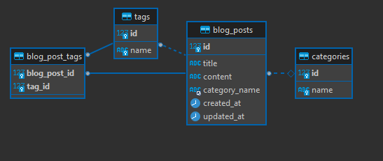

# Blog API

- [Introduction](#overview)
- [Installation](#installation)
- [Usage](#usage)
- [Lessons](#lessons)

# Overview

Project from [roadmap.sh](https://roadmap.sh/projects/blogging-platform-api) built using Go.

A RESTful API with basic CRUD operations for a personal blogging platform.

The goal of this project is to:

- Understand what the RESTful APIs are including best practices and conventions
- Learn how to create a RESTful API
- Learn about common HTTP methods like GET, POST, PUT, PATCH, DELETE
- Learn about status codes and error handling in APIs
- Learn how to perform CRUD operations using an API
- Learn how to work with databases

Requirements:

- Create a new blog post
- Update an existing blog post
- Delete an existing blog post
- Get a single blog post
- Get all blog posts
- Filter blog posts by a search term

## Database Structure

For the database, I am using MySql in a Docker container ([guide](https://www.datacamp.com/tutorial/set-up-and-configure-mysql-in-docker)) and gave this API a specific user
with the following privileges.:

- Alter: alter tables
- Create: create tables
- Delete: delete existing rows
- Insert: create rows
- References: to manage references on tables
- Select: retrieve rows
- Update: update existing rows



**NOTE**:

- Do not use root user to connect to database for this API.
- When launching the API, gorm should populate the needed tables and relationships
  neccessary. If not, you can manually run the `internal/database/create_db.sql` script.

# Installation

**Prerequisite**

- MySql Database ([see Database section](#database-structure))
- Go 1.23

1. `git clone https://github.com/rltran-codex/myblog-api`
2. set environment variables or a `.env` file

```
mysql_user=<username>
mysql_pass=<password>
mysql_addr=<address:port>
mysql_db=<database name>
```

3. configure the server `config.json`

```json
{
  "Address": "0.0.0.0:8080",
  "ReadTimeout": 2000,
  "WriteTimeout": 6000
}
```

4. start the server: `go run ./cmd/blog-api/main.go`

# Usage

Refer [here](https://roadmap.sh/projects/blogging-platform-api) to see the expected responses for each request.

## POST requests

`POST http://localhost:8080/posts`

```json
{
  "title": "My First Blog Post",
  "content": "This is the content of my first blog post.",
  "category": "Technology",
  "tags": ["Tech", "Programming"]
}
```

## GET requests

| type   | request                                              |
| ------ | ---------------------------------------------------- |
| all    | `GET http://localhost:8080/posts`                    |
| search | `GET http://localhost:8080/posts?term=[search term]` |
| by id  | `GET http://localhost:8080/posts/[id]`               |

## PUT requests

`PUT http://localhost:8080/posts/[id]`

```json
{
  "title": "My Updated Blog Post", // (optional) New title of the blog post
  "content": "Updated content here.", // (optional) New content
  "category": "Technology", // (optional) New category
  "tags": ["Tech", "Programming"] // (optional) New tags array
}
```

Note:

- The request body must include at least one of these fields.
- Any omitted fields will remain unchanged.
- Fields included will overwrite existing data.

## DELETE requests

`DELETE http://localhost:8080/posts/[id]`

# Lessons

- GORM
- Gorilla
- Database Design
